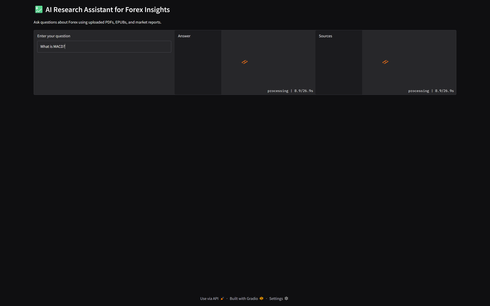
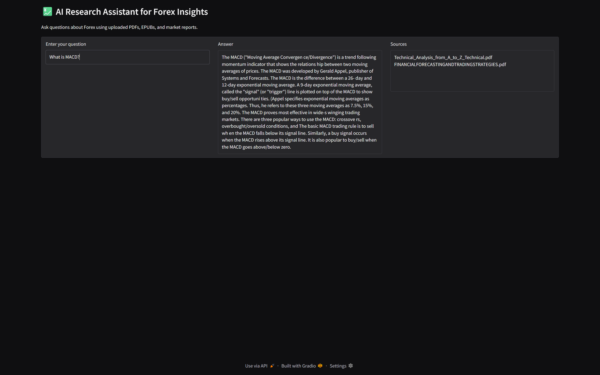

# 💹 RAG Forex Assistant

A Retrieval-Augmented Generation (RAG) AI assistant for Forex insights.  

This project allows you to ask questions about Forex trading using uploaded PDFs, EPUBs, and market reports. The assistant retrieves relevant information from documents, embeds them with HuggingFace embeddings, and answers questions using a locally hosted LLM.

---

## Features

- *Document Ingestion & Embedding*
  - Supports PDF and EPUB formats.
  - Cleans text by removing headers, table-of-contents, references, and other noise.
  - Splits documents into chunks for better semantic search.
  - Embeds chunks using HuggingFaceEmbeddings (all-MiniLM-L6-v2).
  - Persists embeddings in a local Chroma vector store.

- *LLM Integration*
  - Supports a locally downloaded Qwen1.5-4B-Instruct model.
  - Uses 4-bit quantization for memory efficiency.
  - Integrates with LangChain RetrievalQA to answer questions based on retrieved documents.

- *Gradio UI*
  - Simple web interface to ask questions and view answers with sources.
  - Deduplicates source documents.
  - Answers are returned in concise, single-paragraph format.

- *Flexible & Extensible*
  - Works entirely offline after model and document setup.
  - Can be extended to other financial documents, datasets, or models.

---

## Preview

1. Forex Assistant Processing Query
<p align="center">
  
</p>

2. Forex Assistant Displaying Answer and Sources
<p align="center">
  
</p>

---

## Model and Hardware

- **LLM**: Qwen-1.5 4B (4-bit quantized, HuggingFace local model)
- **GPU Tested On**: NVIDIA RTX 4060 Mobile

---

## Installation

1. *Clone the repository*

```bash
git clone https://github.com/yourusername/rag-forex-assistant.git
cd rag-forex-assistant
```

2. Create a Python virtual environment

```bash
python -m venv venv
source venv/bin/activate  # Linux/Mac
venv\Scripts\activate     # Windows
```

3. Install dependencies
```bash
pip install --upgrade pip
pip install -r requirements.txt
```

4. Download the Qwen1.5-4B model

- Place the model in model/Qwen15-4b.

5. Prepare documents

- Place PDFs and EPUBs in the docs/ folder.
- On first run, documents will be automatically ingested into the vector store.

---

## Usage

1. Run the Gradio UI
```bash
python gradio_app.py
```

2. Open the web interface

- The app will be available at http://0.0.0.0:7860.
- Ask questions about Forex and view concise answers with sources.

---

## 🏗️ Project Structure

```
rag-forex-assistant/
│
├── docs/                     # Place your PDFs and EPUBs here
├── model/                    # Local Qwen1.5-4B model
│   └── Qwen15-4b/
├── vector_store/             # Chroma vector store (auto-generated)
├── ingest.py                 # Document ingestion and embedding
├── retriever.py              # Load vector store and create retriever
├── llm.py                    # LLM & RetrievalQA chain creation
├── gradio_app.py             # Gradio web interface
├── requirements.txt          # Python dependencies
└── README.md                 # This file
```

---

## Configuration

- Vector Store Directory
  - Default: vector_store/
  - Change by editing VECTOR_STORE_DIR in gradio_app.py.

- Model Path
  - Default: model/Qwen15-4b
  - Change in llm.py if you place your model elsewhere.

- Retriever Settings
  - Default top-k retrieval: 5
  - Can be adjusted in retriever.py via k parameter.

---

## Notes

- Ensure your GPU has enough memory for Qwen1.5-4B with 4-bit quantization.
- The assistant generates concise answers based solely on retrieved documents.
- The first run may take several minutes to load the model and ingest documents.

---

## License

This project is released under the [MIT License](LICENSE).

---

## Acknowledgements

[LangChain](https://www.langchain.com/) – For RAG pipelines and document chaining.

[HuggingFace Transformers](https://huggingface.co/docs/transformers/index) – For embeddings and LLM integration.

[Chroma](https://www.trychroma.com/) – For vector database and similarity search.

[Gradio](https://gradio.app/) – For the web interface.
